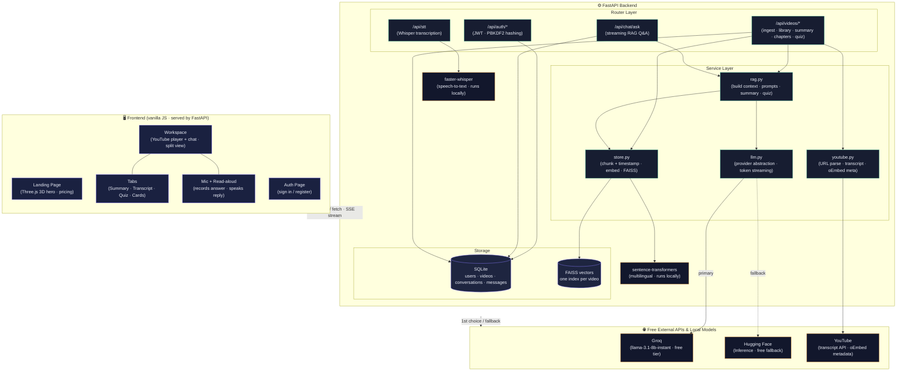

<div align="center">

# ▶ VidSage


### Chat with 

https://github.com/user-attachments/assets/7fd64669-763f-42e7-b46b-4263ae8df306

any YouTube video — in any language

Paste a link, watch on the left, ask on the right. Answers stream in real time,
grounded in the transcript, and cited to the exact second.

**Everything runs on free tiers or your own machine. No paid API anywhere.**

</div>

---

## Overview of project

VidSage turns any YouTube video into something you can *talk to*. Instead of scrubbing
through a 40-minute lecture to find one point, you paste the link, and a Retrieval-Augmented
Generation (RAG) pipeline reads the whole transcript for you. Ask a question in **Bangla,
English, Hindi — any language** — and the answer comes back in the language you asked in,
with clickable timestamps that jump the player straight to the source moment.

It is a complete full-stack application: a FastAPI backend that ingests transcripts, builds
a per-video vector store, and streams grounded answers, plus a zero-build vanilla
HTML/CSS/JS frontend with a 3D landing page and a side-by-side "watch & ask" workspace.

## Features

| | Feature | What it does |
|---|---|---|
| 💬 | **Real-time RAG chat** | Ask about a video; answers stream token-by-token, grounded only in the transcript |
| 🌐 | **Any language, both directions** | Video in one language, question in another — answer always matches your question's language |
| ⏱ | **Timestamp citations** | Every source is a chip; click it and the player seeks to that second |
| 🕒 | **Timestamped summary** | A chapter-by-chapter timeline; each chapter is a one-click jump |
| 📋 | **One-click summary** | Gist, key points, and who the video is for |
| 🎓 | **Quizzes** | Auto-generated 5-question MCQ quiz, scored interactively |
| 🎙 | **Whisper voice input** | Ask by microphone — transcribed locally by Whisper (90+ languages), with browser-speech fallback |
| 🔊 | **Read aloud** | Answers can be spoken back via the browser's speech engine |
| 🔍 | **Searchable transcript** | Full timestamped caption track, filter and click-to-seek |
| 🗂 | **Personal library** | Every analyzed video is saved per user; reopen any time |

## Tech stack

Everything below is free — self-host with a free Groq or Hugging Face key and pay nothing.

| Layer | Technology |
|---|---|
| **LLM** | Groq (`llama-3.1-8b-instant`) *or* Hugging Face Inference — free tier |
| **Embeddings** | `paraphrase-multilingual-MiniLM-L12-v2` (sentence-transformers, local, 50+ languages) |
| **Vector store** | FAISS (on-disk, one index per video) |
| **Speech-to-text** | Whisper via `faster-whisper` (local) — browser Web Speech API fallback |
| **Text-to-speech** | Browser `speechSynthesis` |
| **Transcripts** | `youtube-transcript-api` |
| **Video metadata** | YouTube oEmbed (no API key required) |
| **Backend** | FastAPI · SQLAlchemy · SQLite · JWT auth (PBKDF2-hashed passwords) |
| **Frontend** | Vanilla HTML / CSS / JS · Three.js (3D hero) · YouTube IFrame API |

## Architecture





## Getting started

### Prerequisites
- Python 3.10+
- A free LLM key — **Groq** (recommended, no credit card): <https://console.groq.com>
  *or* a **Hugging Face** token: <https://huggingface.co/settings/tokens>

### Installation

```bash
# 1. Clone
git clone https://github.com/<your-username>/vidsage.git
cd vidsage

# 2. Create a virtual environment
python -m venv .venv
source .venv/bin/activate          # Windows: .venv\Scripts\activate

# 3. Install dependencies
pip install -r requirements.txt

# 4. Configure environment
cp .env.example .env
#   then open .env and paste ONE free key:
#     LLM_PROVIDER=groq
#     GROQ_API_KEY=your_key_here

# 5. Run (the backend serves the frontend too)
uvicorn backend.app:app --reload
```

Open **http://127.0.0.1:8000** — landing page, auth, and workspace are all on the same server.
Interactive API docs live at **/docs**.

> On first use, the multilingual embedding model (~470 MB) downloads once.
> The first voice question downloads the Whisper `base` model (~150 MB) once — or remove
> `faster-whisper` from `requirements.txt` to rely on the browser's built-in speech recognition
> (the mic falls back automatically).

## Configuration

Set these in `.env` (see `.env.example`):

| Variable | Default | Description |
|---|---|---|
| `LLM_PROVIDER` | `groq` | `groq` or `huggingface` |
| `GROQ_API_KEY` | — | Required when provider is `groq` |
| `HF_TOKEN` | — | Required when provider is `huggingface` |
| `GROQ_MODEL` | `llama-3.1-8b-instant` | Any Groq chat model |
| `EMBEDDING_MODEL` | `paraphrase-multilingual-MiniLM-L12-v2` | Local sentence-transformers model |
| `WHISPER_MODEL` | `base` | `tiny` / `base` / `small` |
| `JWT_SECRET` | — | Long random string for signing tokens |

## How a question is answered

1. The question is embedded locally and searched against the video's FAISS index.
2. The top transcript chunks — each carrying its start timestamp — are formatted as `[12:34] …`.
3. The LLM is instructed to answer **only** from those excerpts, cite timestamps, and reply
   in the question's language.
4. Tokens stream back over Server-Sent Events; sources arrive first, so timestamp chips render instantly.
5. The exchange is persisted so conversations survive reloads.

See the full AI pipeline in [`docs/ai-workflow.md`](docs/ai-workflow.md).

## API reference (selected)

| Method | Endpoint | Description |
|---|---|---|
| `POST` | `/api/videos/ingest` | Ingest a YouTube URL → transcript → vector store |
| `POST` | `/api/chat/ask` | Streaming grounded Q&A (SSE) |
| `POST` | `/api/videos/{id}/summary` | One-shot summary |
| `POST` | `/api/videos/{id}/chapters` | Timestamped chapter timeline |
| `POST` | `/api/videos/{id}/quiz` | 5-question MCQ quiz |
| `POST` | `/api/stt` | Whisper transcription of an audio clip |
| `GET`  | `/api/videos/{id}/transcript` | Full timestamped transcript |

## Roadmap

- [ ] Library Agent — one question across every saved video
- [ ] Mind maps & flashcards
- [ ] Public share links for summaries
- [ ] Playlist ingestion
- [ ] Spaced-repetition review

## License

MIT — see [`LICENSE`](LICENSE).

<div align="center">
<sub>Built with FastAPI, FAISS, and free-tier LLMs. No video content is stored beyond the excerpts sent for each answer.</sub>
</div>
